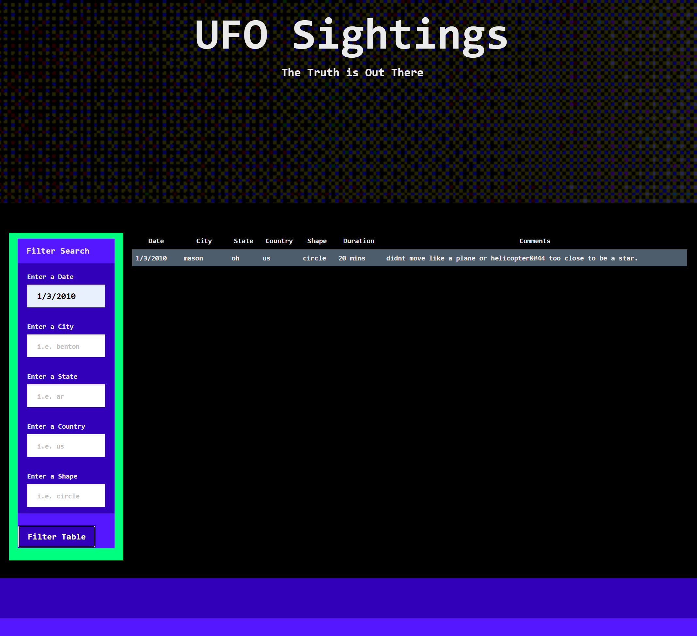

# javascript-challenge
JavaScript and DOM Manipulation

## Level 1: Automatic Table and Date Search
### Goals: 
* Create a basic HTML web page or use the [index.html](StarterCode/index.html) file provided (we recommend building your own custom page!).

* Using the UFO dataset provided in the form of an array of JavaScript objects, write code that appends a table to your web page and then adds new rows of data for each UFO sighting.

  * Make sure you have a column for `date/time`, `city`, `state`, `country`, `shape`, and `comment` at the very least.

* Use a date form in your HTML document and write JavaScript code that will listen for events and search through the `date/time` column to find rows that match user input.

### How to Run:
* Navigate to UFO-level-1/index.html
* Launch index.html in your browser
### How to Filter:
#### By Date
##### Note: The dates only range from _1/1/2010 - 1/13/2010_
* Dates < 10 can only be entered as a single digit i.e., 1 **NOT** 01

## Level 2: Multiple Search Categories
### Goals:
* Complete all of Level 1 criteria.

* Using multiple `input` tags and/or select dropdowns, write JavaScript code so the user can to set multiple filters and search for UFO sightings using the following criteria based on the table columns:

  1. `date/time`
  2. `city`
  3. `state`
  4. `country`
  5. `shape`

### How to Run:
* Navigate to UFO-level-2/index.html
* Launch index.html in your browser
### How to Filter:
When you filter the data, all the conditions are taken into account
#### By Date
##### Note: The dates only range from _1/1/2010 - 1/13/2010_ and, dates < 10 can only be entered as a single digit i.e., 1 **NOT** 01.

#### By City
##### Note: Case does not matter.

#### By State
##### Note: You must enter the state's abbreviation, and case does not matter.

#### By Shape
##### Note: Enter whatever shape you are looking for, and case does not matter.

#### By Country
##### Note: The only country in this dataset is the US and you must enter it as this abbreviation, but case does not matter.

